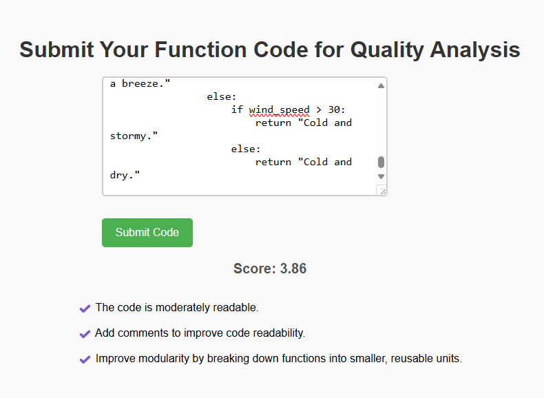

# FunQi - Function Quality Intelligence

FunQi (Function Quality Intelligence) is a **machine learning-powered platform** that evaluates Python functions based on multiple code quality metrics. It provides **automated code quality scores** and **improvement suggestions**, making it useful for developers, software teams, and educators.

##  Features
-  **Code Quality Analysis**: Extracts features like **cyclomatic complexity, modularity, function naming, comment quality, and more** from function.
-  **Machine Learning-Powered**: Uses **trained ML models** (Random Forest) for accurate predictions of code quality score (out of 10).
-  **Detailed Feedback**: Provides suggestions to improve **code readability, maintainability, and efficiency**.
  
---

##  Architecture & Approach
### 1️⃣ Problem Identification & Goal
Current platforms focus on rule-based analysis or syntax correctness. FunQi aims to **predict code quality dynamically** using machine learning.

### 2️⃣ Dataset Creation
- Built a dataset with **six key parameters**: Cyclomatic Complexity, Loops, Function Length, Modularity, Comment Quality, and Naming Quality.
- Assigned an **ideal quality score** based on these parameters for supervised learning.
- [Dataset](https://drive.google.com/file/d/1nvn4jOvwmp0ijSLLtM7MOP0PMaFW076m/view?usp=drive_link)

### 3️⃣ Preprocessing & Model Training
- Used **MinMaxScaler** for normalization.
- Correlation analysis to validate meaningful features.
- Trained multiple ML models (Random Forest, SVM, Gradient Boosting, KNN) and selected the best performer.

### 4️⃣ Algorithm for Metric Calculations
- Extracts **AST-based** metrics using **Radon** and **custom Python functions**.
- **NLP techniques** (NLTK) for analyzing **comment quality** and **function names**.

### 5️⃣ Web App & API Development
- **Backend**: Flask API for model inference.
- **Frontend**: HTML, CSS, JavaScript for UI.
- **Testing**: Verified API responses using **Postman**.

### [For more details, refer to this document](https://drive.google.com/drive/folders/1JAvYrRC82LfXFibrep77lF5CCvMazL0V?usp=sharing)

---
## ML Model Results

Achieved MAE of 0.465 and R^2 of 96.7%


---
## Testing Web App on Python Functions

### [Demo Video](https://drive.google.com/file/d/1rudwVcTvoRlXZkE-sqgYI8HrD5Q_-e5A/view?usp=sharing)

For a poorly written function a score of 2.78 is given with following suggestions:


For a well named and well commented code the score is 8.04:


For a wrongly commented code the results are:


For an uncommented function with a poor name:


For a very long , uncommented function:



---
## Diagrams

**Logic Flow Chart**


**Data Flow Diagram**


### [Algorithm Flowchart](https://drive.google.com/file/d/1onUh792hTZ8d1RRse027DRzlTWaRRFjj/view?usp=drive_link)


---

## 🛠️ Technologies Used
- **Python, Flask** (Backend)
- **scikit-learn, NLTK, Radon, Numpy, Pandas** (ML & Code Analysis)
- **HTML, CSS, JavaScript** (Frontend)
- **Postman** (API Testing)
---

##  Installation & Usage
###  Prerequisites
- Python 3.x
- Flask
- scikit-learn, NLTK, Radon

### 🔹 Clone the Repository
```sh
$ git clone https://github.com/18Venus/Google-Girl-Hackathon-2025.git
```

### 🔹 Install Dependencies
```sh
$ pip install -r requirements.txt
```

### 🔹 Run the Flask App
```sh
$ python app.py
```
---

## Note  
This README provides an overview of the project, including its features, setup instructions, and key components. 

